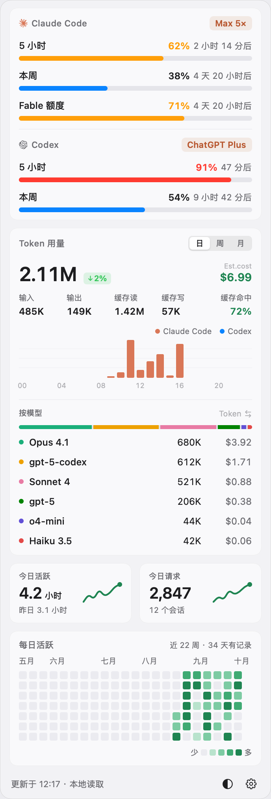
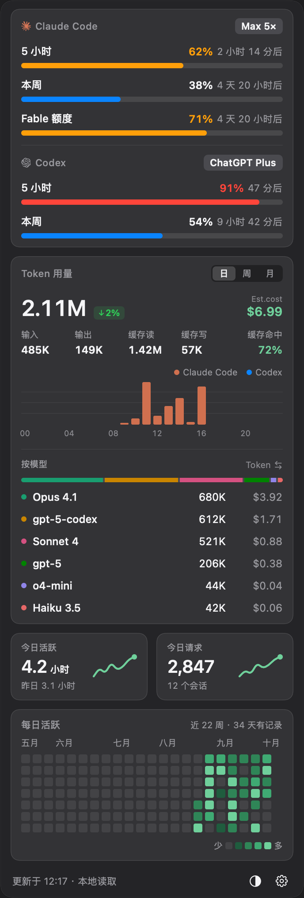
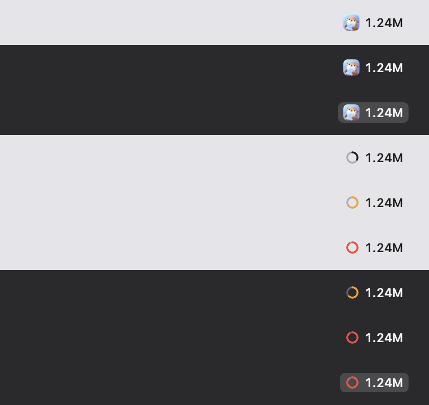
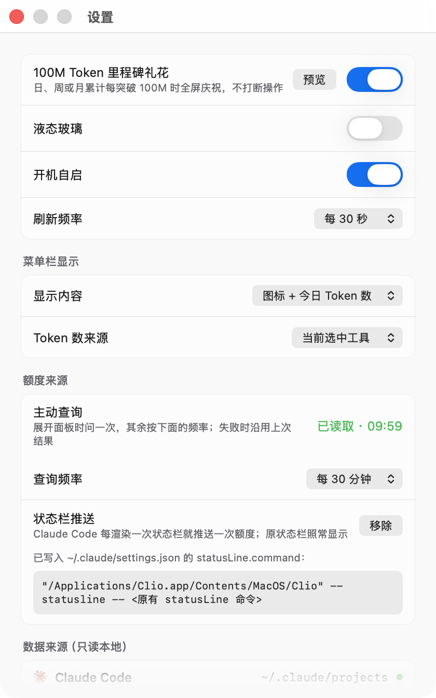

# Clio

macOS 菜单栏里的 Claude Code / Codex 用量面板：额度还剩多少、今天烧了多少 Token、花了多少钱，点一下菜单栏就能看到。

名字取自记述历史的缪斯克利俄——这个工具做的就是把本地会话日志读成一本账。

<p align="center">
  
  
</p>

## 功能

### 额度

- **5 小时**、**本周**、**按模型**（如 Fable）三个窗口的真实利用率与重置时间。
- 利用率超过六成转橙、超过八成转红，菜单栏的用量环同步变色。
- 悬停进度条给出按当前速率的耗尽推算，例如「按当前速率约 1 小时 40 分后耗尽」；在重置前用不完时直说用不完，不给一个比重置时间还远的数字。
- 百分比背后对应多少 Token 从不推断——日志里被拒绝的窗口区间在 53M 到 206M 之间，不是一个固定值。

### 用量

- 日 / 周 / 月三个粒度，各自的 Token 总量、环比、花费估算。
- 输入、输出、缓存读、缓存写，以及缓存命中率。
- 柱状图按小时（日）、按星期（周）、按日期（月）分布，悬停显示该柱的具体数值。
- 按模型的占比条与逐行明细，含各自的 Token 与花费。

### 活跃度

- **今日活跃**：相邻两次回复的间隔求和，每段最多计 5 分钟；副行是昨日同口径。
- **今日请求**：今天的回复条数与去重后的会话数。
- 两张卡片各带一条最近 14 天的折线。
- **每日活跃**热力图，近 22 周，悬停显示某天的日期与用量。近期来自扫描转录文件，更早的部分读 Claude Code 自己的统计缓存补齐。

### 菜单栏

<p align="center"></p>

三种显示方式：仅图标、图标 + 窗口百分比、图标 + 今日 Token 数。

### 里程碑礼花

<p align="center"></p>

日、周或月累计每突破 100M Token 时全屏庆祝，约 5 秒后自动消失，透明且可点穿，不打断手上的操作。设置里可预览、可关闭。

### 其它

- 深色 / 浅色 / 跟随系统。
- 液态玻璃（实验性，macOS 26 及以上）：设置里打开后，面板背景、日/周/月与工具切换、底栏按钮改用系统的液态玻璃材质。
- 日/周/月与工具切换可以按住拖动，松手时选中离得最近的一项；液态玻璃开启时，拖动中的选中块变成玻璃透镜。
- 价格表取自 [models.dev](https://models.dev)，每 24 小时用 ETag 条件请求校验一次，失败时沿用上次结果。
- 自动更新：启动时与每 24 小时查询一次 GitHub Releases。发现新版本后在后台下载安装包，弹出层与设置窗口都关闭时替换当前应用并重启，之后第一次打开面板时底栏提示「已更新到 x.y.z」。设置里关闭「自动安装更新」后只提示新版本，点「更新」才安装；关闭「自动检查更新」则两者都停止。应用所在目录不可写时不自动安装。

## 额度数据从哪来

<p align="center"></p>

三条途径，可同时生效。主动查询的结果经配置缓存读入；合并时比较配置缓存与状态栏推送，取较新的一份。

**读配置缓存**（默认，无需配置，最省）。Claude Code 在运行时会把额度写进 `~/.claude.json` 的 `cachedUsageUtilization`，带 `fetchedAtMs` 时间戳，通常只落后一两分钟。读一个 JSON 文件不起任何进程，所以它是首选来源。

**主动查询**（默认，无需配置）。向 Claude Code 发一条 `get_usage` 控制请求：

```
claude --print --verbose --input-format stream-json --output-format stream-json
{"type":"control_request","request_id":"clio","request":{"subtype":"get_usage","skip_behaviors":true}}
```

用已有的登录，不消耗 Token，不写会话记录。展开面板时问一次，其余按设置里的查询频率（默认 30 分钟）。Claude Code 长时间没运行时，配置缓存会变旧，这条路负责补上。

Claude Code 应答前会把取到的额度连同获取时间写进 `~/.claude.json`，Clio 从那里读回，不直接采用应答：应答本身不带获取时间，距上次获取不到 60 秒或接口请求失败时，应答的是缓存里最长 1 小时前的值。

需要注意的是，Claude Code 把这个请求标为实验性，响应结构可能变化。真变了的话额度会退回只显示窗口内的 Token 数，其余功能不受影响。

**状态栏推送**（可选）。设置里按一下「接入」，把 `~/.claude/settings.json` 的 `statusLine.command` 改写成：

```
"/Applications/Clio.app/Contents/MacOS/Clio" --statusline -- <原有 statusLine 命令>
```

原命令原样保留在后面，状态栏照常渲染。此后 Claude Code 每渲染一次状态栏就推送一次额度，用它时几乎实时。改写前会备份成 `settings.json.bak-clio-<时间戳>`，按「移除」可还原。这条通道不含按模型窗口。

## 数据与隐私

- 只读本地日志：`~/.claude/projects/**/*.jsonl` 与 `~/.codex/sessions`，从不写入。
- 应用自身发出的网络请求有两类：向 models.dev 取价格表；向 GitHub 查询与下载新版本。额度请求是 Claude Code 自己发的。
- 用量数据不离开本机。

## 安装

从 [Releases](https://github.com/UreMySunshine/clio/releases) 下载最新的 `Clio-<版本>.dmg`，打开后把 Clio 拖进「应用程序」。应用不占用程序坞，启动后只在菜单栏出现。

只提供 Apple Silicon 版本，Intel Mac 上打不开。

安装包没有 Apple 开发者签名与公证，在别人的 Mac 上首次打开会被 Gatekeeper 拦下，提示「Apple 无法验证 "Clio" 是否包含可能危害 Mac 安全或泄漏隐私的恶意软件」。三种放行方式任选其一：

**一、系统设置里放行**

1. 双击 Clio，在提示框上点「完成」。
2. 打开「系统设置 → 隐私与安全性」，向下滚到「安全性」一节。
3. 那里会出现一行「已阻止使用 "Clio"…」，点「仍要打开」，再确认一次。

macOS 15 起旧版的「右键 → 打开」已经不能绕过，只能走这条。

**二、命令行摘掉隔离标记**

```bash
xattr -dr com.apple.quarantine /Applications/Clio.app
```

隔离标记是浏览器一类的下载工具加上的，摘掉后直接双击即可。

**三、自己构建**

本地构建出来的 app 不带隔离标记，不会有任何提示：

```bash
git clone https://github.com/UreMySunshine/clio.git
cd clio && Scripts/build.sh && cp -R build/Clio.app /Applications/
```

### 让提示彻底消失

需要 Apple Developer Program 账号。有了之后：

```bash
export CLIO_SIGN_IDENTITY="Developer ID Application: 你的名字 (TEAMID)"
xcrun notarytool store-credentials clio --apple-id <邮箱> --team-id <TEAMID> --password <应用专用密码>
export CLIO_NOTARY_PROFILE=clio
Scripts/package.sh
```

`build.sh` 会改用 Developer ID 签名并启用加固运行时，`package.sh` 会把 dmg 提交公证并装订票据，此后别人下载打开不再有任何提示。两个环境变量都不设时退回 ad-hoc 签名，行为与现在一致。

## 构建

```bash
Scripts/build.sh      # 出 build/Clio.app
Scripts/package.sh    # 出 build/Clio-<版本>.dmg
```

编译走 `swiftc` 直接调用而不是 `swift build`：只装了 Command Line Tools 的机器上，SwiftPM 的清单编译会失败。`Package.swift` 保留给装有完整 Xcode 的机器。

两个开发入口，用来在不点菜单栏的情况下检查读取与排版：

```bash
Clio --dump             # 把解析出的仪表盘打印成文本
Clio --snapshot <目录>   # 把每个界面渲染成 PNG
```

## 已知限制

- Claude Code 的热力图与月环比读 Clio 自己保存的每日用量（`~/Library/Application Support/Clio/daily-tokens.json`）。Claude Code 默认删除 30 天前的转录文件（由 `cleanupPeriodDays` 控制），扫描到不了上月月初；转录文件还不可能被删除的日子按扫描结果记录，之后保留不变。
- 首次运行之前、以及 Clio 停用超过 `cleanupPeriodDays` 天期间的日子，只在第一次遇到时取一次值：有扫描残留用残留，否则用 Claude Code 的统计缓存 `~/.claude/stats-cache.json`。这两种数值都不准：残留只是当天一部分会话；统计缓存把同一次回复按写入的行数重复计入，约为扫描结果的 1.2–2.5 倍，且只在 Claude Code 需要时重算，未必覆盖最近几天。
- 今日活跃是推算值：日志只记录每次回复的时间点，没有会话时长。
- 「开机自启」需要正式签名，ad-hoc 构建下注册会失败，开关会自己弹回关闭。
- 自动更新只核对 GitHub 给出的 SHA-256 摘要、包标识与版本号，没有开发者签名可供校验：安装包的可信程度等同于这个 GitHub 仓库本身。
